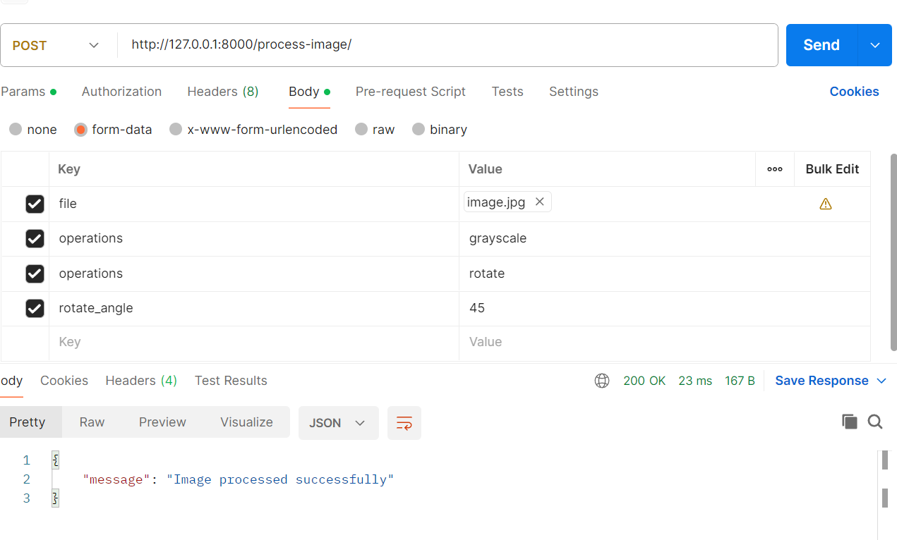
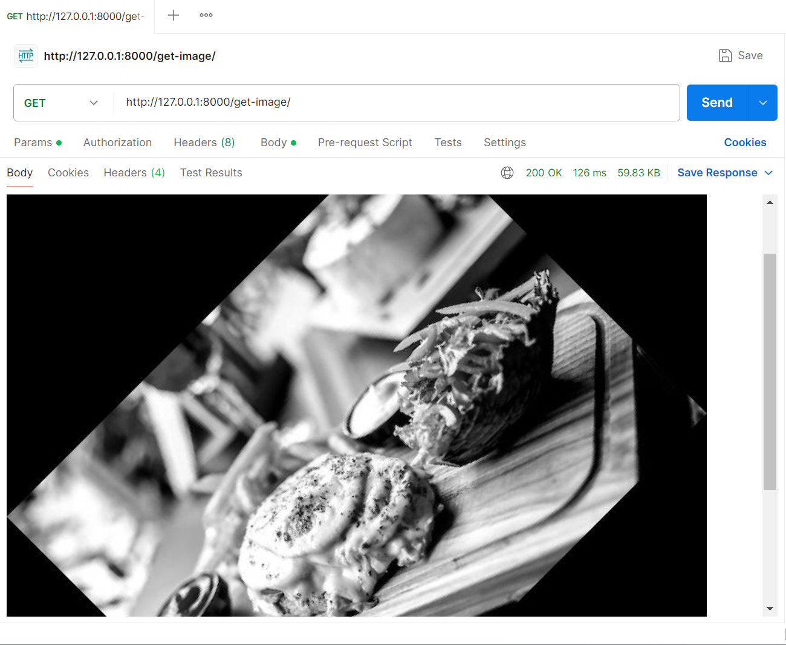

# Image-Processor-API
- The Image Processor API has been built using FastAPI, Pillow, typing and Uvicorn libraries. It allows users to upload images and perform various processing tasks on them.
- API Testing has been done using POSTMAN Desktop.
## Features:
- Upload an image and apply one or more operations (grayscale, rotation with an angle, and a resize to a 300x300)
- Retrieve the processed image
  
## Installation
1. Clone the repository:
```
git clone [repo_url]
cd repo_name

```
2. Create Virtual Environment:
```
python -m venv env_name
source env_name\bin\activate
```
- Or
```
env_name\Scripts\activate
```

3. Install the dependencies:
```
pip install fastapi uvicorn pillow
```

## Usage:
1. Run the FastAPI Application:
```
uvicorn select_ops_app:app --reload
```

2. For the documentation: Open your browser and go to `http://127.0.0.1:8000/docs` to access the Swagger UI and test the API.

3. In POSTMAN:

### `POST /process-image/`
- **Description**: Upload an image and apply one or more operations (grayscale, rotate, resize).
- **Request Body**: 
  - `file` (type: File): An image file (JPEG or PNG).
  - `operations` (type: Text): A list of operations to perform (e.g., `grayscale`, `rotate`, `resize`).
  - `rotate_angle` (type: Text): (Optional) The angle to rotate the image (e.g., `90`).

- **Response**: A message indicating successful processing.

### `GET /get-image/`

- **Description**: Retrieve the processed image.
- **Response**: The processed image in JPEG format.

### Example

You can test the API using the Swagger UI at `http://127.0.0.1:8000/docs` or with a tool like `curl` or Postman.

I have used POSTMAN for this execution:

1. For the POST operation:


2. For the GET Operation:



